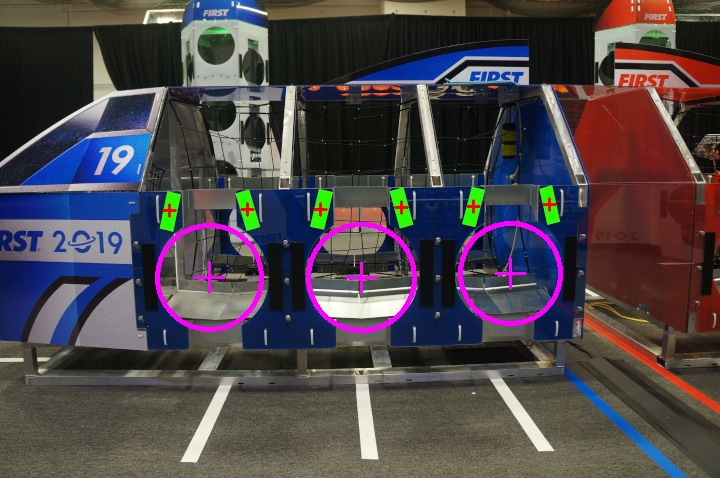

# FRC Robot Vision API
The Robot Vision API allows FRC teams to specify some key parameters about the target they are looking for, and receive the location of the target in a given image. Developed through FRC Team 5112, The Gongoliers.



## Getting started

### Install
To use the the Library of Gongolierium with Gradle projects, you can use [JitPack](https://jitpack.io/) by adding the following lines to your `build.gradle` file:

```Gradle
repositories {
    ...
    maven { url 'https://jitpack.io' }
}

dependencies {
    ...
    compile 'com.github.kylecorry31:Robot-Vision-API:v1.1.1'
}
```


### Usage (FRC 2019 Vision Example)
```Java
/**
 * Detects the 2019 vision targets.
 * @param image The image from the camera.
 * @return The list of vision target groups.
 */
public List<Target> detect2019Targets(Mat image){
  // Adjust these parameters for your team's needs

  // Target filter parameters
  double minBrightness = 200;
  double maxBrightness = 255;

  // Contour filter parameters
  Range area = new Range(0.03, 100);
  Range fullness = new Range(0, 100);
  Range aspectRatio = new Range(0.2, 4);

  // Camera settings
  FOV fov = new FOV(50, 40); // This is the approx. Microsoft LifeCam FOV
  Resolution resolution = new Resolution(640, 480);
  boolean cameraInverted = false;

  int imageArea = resolution.getArea();

  // An HSV filter may be better for FRC target detection
  TargetFilter filter = new BrightnessFilter(minBrightness, maxBrightness);
  ContourFilter contourFilter = new StandardContourFilter(area, fullness, aspectRatio, imageArea);
  CameraSettings cameraSettings = new CameraSettings(cameraInverted, fov, resolution);
  TargetFinder targetFinder = new TargetFinder(cameraSettings, filter, contourFilter, TargetGrouping.SINGLE);

  // Find the targets
  List<Target> targets = targetFinder.findTargets(image);

  // Sort the targets by x coordinates
  targets.sort(Comparator.comparingDouble(target -> target.getBoundary().center.x));

  List<Target> bays = new ArrayList<>();
  // If the current target is a left and the next is a right, make it a pair
  for (int i = 0; i < targets.size() - 1; i++) {
      Target current = targets.get(i);
      Target next = targets.get(i + 1);

      // Determine if the targets are a left and right pair
      if (isLeftTarget(current) && isRightTarget(next)){
          // Combine the targets
          Target bay = TargetUtils.combineTargets(current, next, cameraSettings);
          bays.add(bay);
          // Skip the next target
          i++;
      }
  }

  return bays;
}

/**
 * Determines if a target is a left vision target.
 * @param target The target.
 * @return True if it is a left target.
 */
private boolean isLeftTarget(Target target){
    return target.getSkew() < 0;
}

/**
 * Determines if a target is a right vision target.
 * @param target The target.
 * @return True if it is a right target.
 */
private boolean isRightTarget(Target target){
    return target.getSkew() > 0;
}

```

## Contributing
Please fork this repo and submit a pull request to contribute. I will review all changes and respond if they are accepted or rejected (as well as reasons, so it will be accepted).

## License
This project is published under the [GPL-3.0 license](LICENSE).
